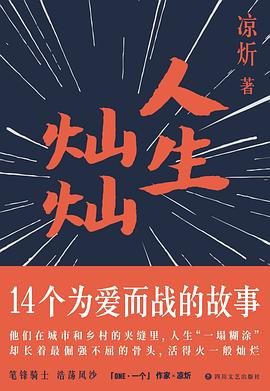

# 👋 你好，  
# 我是赵纯想

我写一些小说、代码和剧本。梦想是拍电影。

### 下方罗列了我在这世界上创造的东西。

---
## **软件**

### [转山App](https://book.douban.com/subject/26990080/)
***iOS端个人行为管理软件**, 上架于AppStore – (2022年12月15日 - 当前版本：1.0.2)*

“转山”是一种盛行于西藏地区的庄严活动。信徒们围绕冈仁波齐（གངས་རིན་པོ་ཆེ），笃定地重复脚下的路线——转山App正是构想于此，帮助你：规划行为的循环，记录每一次专注。直至知行合一，抵达你内心的圣山。  

[下载（*系统版本要求：iOS15.0+*）](https://book.douban.com/subject/26990080/)

---
## **课程**

### [iOS开发入门课](https://www.cctalk.com/m/group/90565680)
***SwiftUI课程**, 上架在CCTalk – (¥299.00)*

- 0基础。0计算机知识。完全小白的新手课。用生活中的字眼，解释编程世界中的“看似高大上的词汇”。纵观全网，最轻松的“单口相声版”《SwiftUI入门教程》，由讲课鬼才赵纯想出品。

[课程报名](https://www.cctalk.com/m/group/90565680)

---

## **小说**

### [光谷广场](%E5%85%89%E8%B0%B7%E5%B9%BF%E5%9C%BA.md)

***长篇小说**, 未出版 – (2022-11-9)*

### [坏一坏](https://book.douban.com/subject/26990080/)
***短篇小说集**, 长江文艺出版社 – (2017-4-1 - ISBN: 9787541145087)*  

- 凉炘的小说虽然以“坏一坏”冠名，但其实坏中有深情，我能读到他骨子里藏不住深情款款，“假坏真善”最是青春时，愿每一个读完作品的多情少年莫负春光。 ———蔡崇达

- 记忆最深刻，是凉炘笔下的兰州。作为兰州人，不管前一天晚上如何醉生梦死，“坏上一坏”，第二天早晨吃一碗牛肉面就都过去了。 ————低苦艾乐队

### [人生灿灿](https://book.douban.com/subject/34865437/)
***短篇小说集**, 四川文艺出版社 – (2019-11 - ISBN: 9787541155109)*  

- 收录凉炘短篇小说十四篇，包括在“One·一个”App中高点击量与高赞的作品。一群有着不同年龄、阅历的底层小人物，他们拒绝向生命中的苦难屈服，选择了以自己的方式投入战斗，捍卫所爱。

---

## **电影**

<!--  -->

### [春天简史](https://movie.douban.com/subject/35708474/)
***编剧，主演**, 导演 郭无用  (2020 - 短片)*  

### [你我皆凡人](./film/film.md)

***编剧**, 导演 郭无用*

[电影剧组文档](./film/film.md)

---

## **联系我**

[📧 liseami@qq.com](mailto:liseami@qq.com)

[📧 微博](https://weibo.com/274300559)

[🔗 抖音 - 赵纯想](https://v.douyin.com/r9A8Kxu/)

[👾 私人微信](copy:zhaochunxiang1109)  